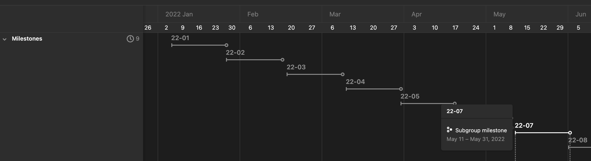

# rollingstones

Create cascading, time-based milestones in Gitlab.



## docker

```bash
$ docker run -it --rm \
  -e GITLAB_HOST \
  -e GITLAB_TOKEN \
  weisjohn/rollingstones -g 444 # ... see below
```

## install

```console
$ npm install -g rollingstones
```

## usage

```console
$ rollingstones --help
Usage: rollingstones [options]

Options:
  -g, --group <id>        gitlab group id
  -s, --start <date>      start date - YYYY-MM-DD (default: "2021-11-18")
  -e, --end <date>        end date - YYYY-MM-DD
  -i, --interval <weeks>  length of sprint in weeks (default: 3)
  -d, --debug             extra debugging info
  -y, --yes               create the milestones
  -v, --version           output current version
  -h, --help              display help for command

$GITLAB_HOST and $GITLAB_TOKEN must be set on the environment
```

where:

`GITLAB_HOST` is the URL of your Gitlab install.
`GITLAB_TOKEN` is [a personal access token with `api` scope](https://docs.gitlab.com/ee/user/profile/personal_access_tokens.html).

## options

`rollingstones` allows you to create time-based, group-level milestones in Gitlab.

It will automatically generate milestones with start and end dates based upon a max start and end date and a specified sprint duration.

| option           | purpose                         | default          |
|------------------|---------------------------------|------------------|
| `-g, --group`    | Gitlab Group ID                 | required         |
| `-s, --start`    | Start Date                      | `today`          |
| `-e, --end`      | End Date                        | `start + 1 year` |
| `-i, --interval` | Sprint duration in weeks        | `3` weeks        |
| `-d, --debug`    | print debug information         | `false`          |
| `-y, --yes`      | actually create the milestones  | `false`          |


For example, to create given Q1 of 2022:
```console
$ cal 2022 | head -n 10
                            2022
      January               February               March
Su Mo Tu We Th Fr Sa  Su Mo Tu We Th Fr Sa  Su Mo Tu We Th Fr Sa
                   1         1  2  3  4  5         1  2  3  4  5
 2  3  4  5  6  7  8   6  7  8  9 10 11 12   6  7  8  9 10 11 12
 9 10 11 12 13 14 15  13 14 15 16 17 18 19  13 14 15 16 17 18 19
16 17 18 19 20 21 22  20 21 22 23 24 25 26  20 21 22 23 24 25 26
23 24 25 26 27 28 29  27 28                 27 28 29 30 31
30 31
```

in order to create two week sprints beginning on Tuesday, January 4th, 2022, simply:

```console
$ rollingstones -g 444 --start 2022-01-04 --end 2022-03-31

Milestones to be created:
┌─────────┬─────────┬──────────────┬──────────────┐
│ (index) │  title  │  start_date  │   due_date   │
├─────────┼─────────┼──────────────┼──────────────┤
│    0    │ '22-01' │ '2022-01-04' │ '2022-01-24' │
│    1    │ '22-02' │ '2022-01-25' │ '2022-02-14' │
│    2    │ '22-03' │ '2022-02-15' │ '2022-03-07' │
│    3    │ '22-04' │ '2022-03-08' │ '2022-03-28' │
└─────────┴─────────┴──────────────┴──────────────┘

Should we proceed?
To create the milestones, set `--yes`
```

After confirming the milestones are correct, re-run the command with `--yes` to actually take action. 

`rollingstones` will display a link to the milestones created, such as:

```console
Milestone created: https://mygitlab.test/groups/sandbox/milestone-test/-/milestones/16
Milestone created: https://mygitlab.test/groups/sandbox/milestone-test/-/milestones/17
Milestone created: https://mygitlab.test/groups/sandbox/milestone-test/-/milestones/18
Milestone created: https://mygitlab.test/groups/sandbox/milestone-test/-/milestones/19
```

## recovery

`rollingstones` is designed to handle situations like projects that extend, milestones that accidentally got deleted, or multi-year projects. Data-syncing is based upon attempting to match the `start_date` of the milestones.

For example, let's say your project already has a few milestones, but now you need to  `rollingstones` will show you which already exist in that series and which will need to be created.

```console
$ rollingstones -g 444 --start 2022-01-05 --end 2022-08-03 -i 3 
(node:55559) Warning: Setting the NODE_TLS_REJECT_UNAUTHORIZED environment variable to '0' makes TLS connections and HTTPS requests insecure by disabling certificate verification.
(Use `node --trace-warnings ...` to show where the warning was created)

Milestones in series:
┌─────────┬─────────┬──────────────┬──────────────┬───────────────────────────────────────────────────────────────────────┐
│ (index) │  title  │  start_date  │   due_date   │                                     web_url                           │
├─────────┼─────────┼──────────────┼──────────────┼───────────────────────────────────────────────────────────────────────┤
│    0    │ '22-01' │ '2022-01-05' │ '2022-01-25' │ 'https://mygitlab.test/groups/sandbox/milestone-test/-/milestones/10' │
│    1    │ '22-02' │ '2022-01-26' │ '2022-02-15' │ 'https://mygitlab.test/groups/sandbox/milestone-test/-/milestones/11' │
│    2    │ '22-03' │ '2022-02-16' │ '2022-03-08' │ 'https://mygitlab.test/groups/sandbox/milestone-test/-/milestones/12' │
│    3    │ '22-04' │ '2022-03-09' │ '2022-03-29' │ 'https://mygitlab.test/groups/sandbox/milestone-test/-/milestones/13' │
│    4    │ '22-05' │ '2022-03-30' │ '2022-04-19' │ 'https://mygitlab.test/groups/sandbox/milestone-test/-/milestones/14' │
└─────────┴─────────┴──────────────┴──────────────┴───────────────────────────────────────────────────────────────────────┘

Milestones to be created:
┌─────────┬─────────┬──────────────┬──────────────┐
│ (index) │  title  │  start_date  │   due_date   │
├─────────┼─────────┼──────────────┼──────────────┤
│    0    │ '22-06' │ '2022-04-20' │ '2022-05-10' │
│    1    │ '22-07' │ '2022-05-11' │ '2022-05-31' │
│    2    │ '22-08' │ '2022-06-01' │ '2022-06-21' │
│    3    │ '22-09' │ '2022-06-22' │ '2022-07-12' │
└─────────┴─────────┴──────────────┴──────────────┘

Should we proceed?
To create the milestones, set `--yes`
```
